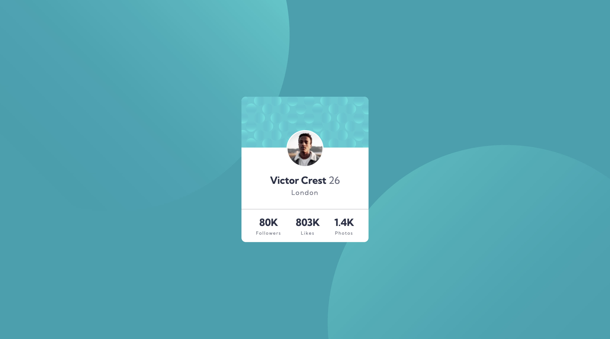

# Frontend Mentor - Profile card component solution

This is a solution to the [Profile card component challenge on Frontend Mentor](https://www.frontendmentor.io/challenges/profile-card-component-cfArpWshJ).

## Table of contents

- [Overview](#overview)
  - [The challenge](#the-challenge)
  - [Screenshot](#screenshot)
  - [Links](#links)
- [My process](#my-process)
  - [Built with](#built-with)
  - [What I learned](#what-i-learned)
  - [Continued development](#continued-development)
  - [Useful resources](#useful-resources)
- [Author](#author)

## Overview

### The challenge

- Build out the project to the designs provided

### Screenshot



### Links

- Live Site URL: <a href="https://frontend-mentor-profile-card-35e5f.web.app/" target="_blank">Click Here</a>

## My process

### Built with

- HTML5
- CSS
- Flexbox
- CSS Grid
- Firebase Hosting

### What I learned

I learnt how to position background image.

```css
background-image: url(/images/bg-pattern-top.svg),
	url(/images/bg-pattern-bottom.svg);
background-repeat: no-repeat, no-repeat;
background-position: left -180px bottom 350px, right -200px top 400px;
```

### Continued development

I need to understand this feature more and make it more responsive and fluid in positioning background images. Maybe learn css framework like bootstrap or tailwind to gain more experience.

### Useful resources

- <a href="https://developer.mozilla.org/en-US/docs/Web/CSS/background-position" target="_blank">Position Background</a> - This helped me understand how to position background images.

## Author

- Linkedin - [Jaweed Inayathulla](https://www.linkedin.com/in/jaweedinayathulla/)
- Frontend Mentor - [@InaJaweed](https://www.frontendmentor.io/profile/InaJaweed)
